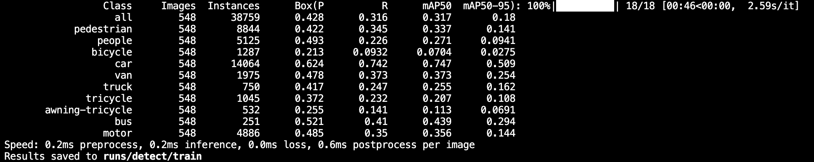
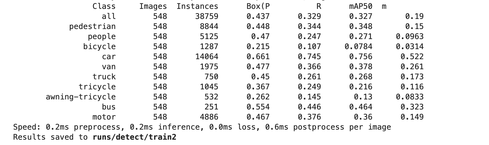
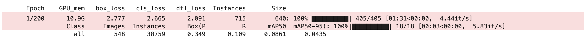

# YOLO v8

## 模型训练

```python
# train
from ultralytics import YOLO
model = YOLO("/root/result/PConv.yaml")
# 加载预训练模型
model.load("/root/result/yolov8n.pt")
model.train(data="/root/result/visdrone.yaml", epochs=200, batch=32) 
```

## 改进流程

- 编写模块算法，放在 ultralytics/nn/attention 路径
- 更改 ultralytics/nn/tasks.py 文件
  - 注册新模块
  - 更改 parse_model 函数
- 更改配置文件

## 现有方法

- LSKA 模块
  - 算法实现 attention/LSKA.py
  - 配置文件 cfg/LSKA.yaml
  - ultralytics/nn/tasks.py 修改

  ```python
  from ultralytics.nn.attention.LSKA import C2f_LSKA_Attention
  def parse_model(d, ch, verbose=True):
    # 加入 C2f_LSKA_Attention
    if m in (Classify, Conv, ConvTranspose, GhostConv, Bottleneck, GhostBottleneck, SPP, SPPF, DWConv, Focus,
                 BottleneckCSP, C1, C2, C2f, C3, C3TR, C3Ghost, nn.ConvTranspose2d, DWConvTranspose2d, C3x, C2f_LSKA_Attention):
      # 加入 C2f_LSKA_Attention
      if m in (BottleneckCSP, C1, C2, C2f, C3, C3TR, C3Ghost, C3x, C2f_LSKA_Attention):
        args.insert(2, n)
        n = 1
  ```

  - 实验结果 
- CoordAttention 模块
  - 算法实现 attention/CoordAttention.py
  - 配置文件 cfg/CoordAttention.yaml
  - ultralytics/nn/tasks.py 修改

  ```python
  from ultralytics.nn.attention.CoordAttention import CoordAtt
  def parse_model(d, ch, verbose=True):
    # 加入 CoordAtt
    if m in (Classify, Conv, ConvTranspose, GhostConv, Bottleneck, GhostBottleneck, SPP, SPPF, DWConv, Focus,
                 BottleneckCSP, C1, C2, C2f, C3, C3TR, C3Ghost, nn.ConvTranspose2d, DWConvTranspose2d, C3x, CoordAtt):
  ```

  - 实验结果 

- DWR
  - 算法实现 attention/DWR.py
  - 配置文件 cfg/DWR.yaml
  - ultralytics/nn/tasks.py 修改

  ```python
  from ultralytics.nn.attention.DWR import C2f_DWR
  def parse_model(d, ch, verbose=True):
    # 加入 DWR
    if m in (Classify, Conv, ConvTranspose, GhostConv, Bottleneck, GhostBottleneck, SPP, SPPF, DWConv, Focus,
                 BottleneckCSP, C1, C2, C2f, C3, C3TR, C3Ghost, nn.ConvTranspose2d, DWConvTranspose2d, C3x, C2f_DWR):
      # 加入 DWR
      if m in (BottleneckCSP, C1, C2, C2f, C3, C3TR, C3Ghost, C3x, C2f_DWR):
        args.insert(2, n)
        n = 1
  ```

  - 实验结果

- SEAM
  - 算法实现 attention/SEAM.py
  - 配置文件 cfg/SEAM.yaml cfg/multiSEAM.yaml
  - ultralytics/nn/tasks.py 修改

  ```python
  from ultralytics.nn.attention.SEAM import SEAM, MultiSEAM
  def parse_model(d, ch, verbose=True):
    # 加入 SEAM, MultiSEAM
    if m in (Classify, Conv, ConvTranspose, GhostConv, Bottleneck, GhostBottleneck, SPP, SPPF, DWConv, Focus,
              BottleneckCSP, C1, C2, C2f, C3, C3TR, C3Ghost, nn.ConvTranspose2d, DWConvTranspose2d, C3x, SEAM, MultiSEAM):
  ```

  - 实验结果

- MetaNeXtStage
  - 算法实现 attention/MetaNeXtStage.py
  - 配置文件 cfg/MetaNeXtStage.yaml
  - ultralytics/nn/tasks.py 修改

  ```python
  from ultralytics.nn.attention.MetaNeXtStage import MetaNeXtStage
  def parse_model(d, ch, verbose=True):
    # 加入 MetaNeXtStage
    if m in (Classify, Conv, ConvTranspose, GhostConv, Bottleneck, GhostBottleneck, SPP, SPPF, DWConv, Focus,
              BottleneckCSP, C1, C2, C2f, C3, C3TR, C3Ghost, nn.ConvTranspose2d, DWConvTranspose2d, C3x, MetaNeXtStage):
      # 加入 MetaNeXtStage
      if m in (BottleneckCSP, C1, C2, C2f, C3, C3TR, C3Ghost, C3x, MetaNeXtStage):
        args.insert(2, n)
        n = 1
  ```

  - 实验结果

- PConv
  - 算法实现 attention/PConv.py
  - 配置文件 cfg/PConv.yaml
  - ultralytics/nn/tasks.py 修改

  ```python
  from ultralytics.nn.attention.PConv import PConv
  def parse_model(d, ch, verbose=True):
    # 加入 PConv
    if m in (Classify, Conv, ConvTranspose, GhostConv, Bottleneck, GhostBottleneck, SPP, SPPF, DWConv, Focus,
              BottleneckCSP, C1, C2, C2f, C3, C3TR, C3Ghost, nn.ConvTranspose2d, DWConvTranspose2d, C3x, PConv):
  ```

  - 实验结果

- SimAM
  - 算法实现 attention/SimAM.py
  - 配置文件 cfg/SimAM.yaml
  - ultralytics/nn/tasks.py 修改

  ```python
  from ultralytics.nn.attention.SimAM import SimAM
  def parse_model(d, ch, verbose=True):
    # 加入 SimAM
    elif m is SimAM:
      c1, c2 = ch[f], args[0]
      if c2 != nc:
          c2 = make_divisible(min(c2, max_channels) * width, 8)
      args = [c1, *args[1:]]
  ```

  - 实验结果

- NAMAttention
  - 算法实现 attention/NAMAttention.py
  - 配置文件 cfg/NAMAttention.yaml
  - ultralytics/nn/tasks.py 修改

  ```python
  from ultralytics.nn.attention.NAMAttention import NAMAttention
  def parse_model(d, ch, verbose=True):
    # 加入 NAMAttention
    if m in (Classify, Conv, ConvTranspose, GhostConv, Bottleneck, GhostBottleneck, SPP, SPPF, DWConv, Focus,
                 BottleneckCSP, C1, C2, C2f, C3, C3TR, C3Ghost, nn.ConvTranspose2d, DWConvTranspose2d, C3x, NAMAttention):
  ```

  - 实验结果

- DWR+SimAM
  - 算法实现 attention/DWR.py attention/SimAM.py
  - 配置文件 cfg/DWR_SimAM.yaml
  - 实验结果

- DualVIT
  - 算法实现 attention/DualVIT.py
  - 配置文件 cfg/DualVIT.yaml
  - ultralytics/nn/tasks.py 修改

  ```python
  from ultralytics.nn.attention.DualVIT import MergeBlockattention
  def parse_model(d, ch, verbose=True):
    # 加入 MergeBlockattention
    if m in (Classify, Conv, ConvTranspose, GhostConv, Bottleneck, GhostBottleneck, SPP, SPPF, DWConv, Focus,
                 BottleneckCSP, C1, C2, C2f, C3, C3TR, C3Ghost, nn.ConvTranspose2d, DWConvTranspose2d, C3x, MergeBlockattention):
  ```

  - 实验结果

- deformable_LKA
  - 算法实现 attention/deformable_LKA.py
  - 配置文件 cfg/deformable_LKA.yaml
  - ultralytics/nn/tasks.py 修改

  ```python
  from ultralytics.nn.attention.deformable_LKA import C2f_deformable_LKA
  def parse_model(d, ch, verbose=True):
    # 加入 C2f_deformable_LKA
    if m in (Classify, Conv, ConvTranspose, GhostConv, Bottleneck, GhostBottleneck, SPP, SPPF, DWConv, Focus,
                 BottleneckCSP, C1, C2, C2f, C3, C3TR, C3Ghost, nn.ConvTranspose2d, DWConvTranspose2d, C3x, C2f_deformable_LKA):
      # 加入 C2f_deformable_LKA
      if m in (BottleneckCSP, C1, C2, C2f, C3, C3TR, C3Ghost, C3x, C2f_deformable_LKA):
        args.insert(2, n)
        n = 1
  ```

  - 实验结果

- DSConv
  - 算法实现 attention/DSConv.py
  - 配置文件 cfg/DSConv.yaml
  - ultralytics/nn/tasks.py 修改

  ```python
  from ultralytics.nn.attention.DSConv import C2f_DySnakeConv
  def parse_model(d, ch, verbose=True):
    # 加入 C2f_DySnakeConv
    if m in (Classify, Conv, ConvTranspose, GhostConv, Bottleneck, GhostBottleneck, SPP, SPPF, DWConv, Focus,
                 BottleneckCSP, C1, C2, C2f, C3, C3TR, C3Ghost, nn.ConvTranspose2d, DWConvTranspose2d, C3x, C2f_DySnakeConv):
      # 加入 C2f_DySnakeConv
      if m in (BottleneckCSP, C1, C2, C2f, C3, C3TR, C3Ghost, C3x, C2f_DySnakeConv):
        args.insert(2, n)
        n = 1
  ```

  - 实验结果

- DCN
  - 算法实现 attention/DCN.py
  - 配置文件 cfg/DCN.yaml
  - ultralytics/nn/tasks.py 修改

  ```python
  from ultralytics.nn.attention.DCN import DCNV2
  def parse_model(d, ch, verbose=True):
    # 加入 DCNV2
    if m in (Classify, Conv, ConvTranspose, GhostConv, Bottleneck, GhostBottleneck, SPP, SPPF, DWConv, Focus,
                 BottleneckCSP, C1, C2, C2f, C3, C3TR, C3Ghost, nn.ConvTranspose2d, DWConvTranspose2d, C3x, DCNV2):
      # 加入 DCNV2
      if m in (BottleneckCSP, C1, C2, C2f, C3, C3TR, C3Ghost, C3x, DCNV2):
        args.insert(2, n)
        n = 1
  ```

  - 实验结果

- WIoU，SIoU，EIoU，α-IoU -> IOU
  - ultralytics/utils/metrics.py 修改
  
    ```python
    将 iou/iou_1.py 文件内容复制到 metrics.py 文件中
    ```

  - ultralytics/utils/loss.py 修改

  ```python
  class BboxLoss(nn.Module):
    # 注释下面两行
    # iou = bbox_iou(pred_bboxes[fg_mask], target_bboxes[fg_mask], xywh=False, CIoU=True)
    # loss_iou = ((1.0 - iou) * weight).sum() / target_scores_sum
    # 将下面代码复制进去
    iou = bbox_iou_improve(pred_bboxes[fg_mask], target_bboxes[fg_mask], xywh=False, WIoU=True)
    if type(iou) is tuple:
        if len(iou) == 2:
            loss_iou = ((1.0 - iou[0]) * iou[1].detach() * weight).sum() / target_scores_sum
        else:
            loss_iou = (iou[0] * iou[1] * weight).sum() / target_scores_sum
    else:
        loss_iou = ((1.0 - iou) * weight).sum() / target_scores_sum
  ```

  - ultralytics/utils/tal.py 修改

  ```python
  def get_box_metrics(self, pd_scores, pd_bboxes, gt_labels, gt_bboxes, mask_gt):
    # 注释下面一行
    # overlaps[mask_gt] = bbox_iou(gt_boxes, pd_boxes, xywh=False, CIoU=True).squeeze(-1).clamp_(0)
    # 将下面代码复制进去
    overlaps[mask_gt] = bbox_iou(gt_boxes, pd_boxes, xywh=False, WIoU=True).squeeze(-1).clamp(0)
  ```

- SPD
  - 算法实现 attention/SPD.py
  - 配置文件 cfg/SPD.yaml
  - ultralytics/nn/tasks.py 修改

  ```python
  from ultralytics.nn.attention.SPD import space_to_depth
  def parse_model(d, ch, verbose=True):
    # 加入 space_to_depth
    elif m is space_to_depth:
      c2 = 4 * ch[f]
  ```

  - 实验结果

- VanillaNet
  - 算法实现 attention/VanillaNet.py
  - 配置文件 cfg/VanillaNet.yaml
  - ultralytics/nn/tasks.py 修改

  ```python
  from ultralytics.nn.attention.VanillaNet import VanillaBlock
  def parse_model(d, ch, verbose=True):
    # 加入 VanillaBlock
    if m in (Classify, Conv, ConvTranspose, GhostConv, Bottleneck, GhostBottleneck, SPP, SPPF, DWConv, Focus,
                 BottleneckCSP, C1, C2, C2f, C3, C3TR, C3Ghost, nn.ConvTranspose2d, DWConvTranspose2d, C3x, VanillaBlock):
  ```

  - 实验结果

- SmallObj
  - 配置文件 cfg/SmallObj.yaml
  - 实验结果

- Sophia -> 优化器
  - 算法实现 optimizer/sophia.py
  - ultralytics/yolo/engine/trainer.py 修改
  
  ```python
  def build_optimizer(model, name='Adam', lr=0.001, momentum=0.9, decay=1e-5):
    elif name == 'SophiaG':
      optimizer = torch.optim.SophiaG(g[2], lr=lr, betas=(momentum, 0.999), rho=0.04, weight_decay=0.0)
  ```

  - ultralytics/yolo/cfg/default.yaml 修改

  ```yaml
    optimizer: SophiaG
  ```

  - 将 sophia.py 加入环境

  ```python
  # envs 为 python 环境目录
  sophia.py -> envs\lib\site-packages\torch\optim
  修改 __init__.py -> 加入 from .sophia import SophiaG
  ```

## 问题总结

- 注意事项
  - 根据导入模块进行相应设置
- 更改 backbone 及 head 后，预训练权重是如何加载的
  - YOLO v8

  ```python
    # 模型未改变，但类别数目变化
    # Transferred 319/355 items from pretrained weights
  ```

  - CoordAttention

  ```python
    # 模型在 backbone 处发生改变
    # Transferred 97/388 items from pretrained weights
  ```

  - LSKA

  ```python
    # 模型在 head 处发生改变
    # Transferred 271/363 items from pretrained weights
  ```

  - CoTAttention

  ```python
    # Transferred 210/415 items from pretrained weights
    model = YOLO("/root/result/CoTAttention.yaml")
    # 是否导入预训练权重
    model.load("/root/result/yolov8n.pt")
    model.train(data="/root/result/visdrone.yaml",epochs=200) 
  ```

- 导入/不导入预训练权重的训练趋势
  - 导入预训练权重 -> 加速收敛
      
  - 不导入预训练权重
      
