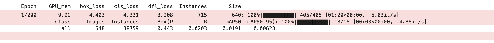

# YOLO v8

## 改进流程

- 编写模块算法，放在 ultralytics/nn 路径
- 更改 ultralytics/nn/tasks.py 文件
  - 注册新模块
  - 更改 parse_model 函数
- 更改配置文件，放在 ultralytics/cfg/models/v8 路径

## 现有方法

- LSKA 模块
  - 算法实现 attention/LSKA.py
  - 配置文件 cfg/LSKA.yaml
  - ultralytics/nn/tasks.py 修改

  ```python
  from ultralytics.nn.attention.LSKA import C2f_LSKA_Attention
  def parse_model(d, ch, verbose=True):
    # 加入 C2f_LSKA_Attention
    if m in (Classify, Conv, ConvTranspose, GhostConv, Bottleneck, GhostBottleneck, SPP, SPPF, DWConv, Focus,
                 BottleneckCSP, C1, C2, C2f, C3, C3TR, C3Ghost, nn.ConvTranspose2d, DWConvTranspose2d, C3x, C2f_LSKA_Attention):
    # 加入 C2f_LSKA_Attention
    if m in (BottleneckCSP, C1, C2, C2f, C3, C3TR, C3Ghost, C3x, C2f_LSKA_Attention):
                args.insert(2, n)
                n = 1
  ```

  - 实验结果 
- CoordAttention 模块
  - 算法实现 attention/CoordAttention.py
  - 配置文件 cfg/CoordAttention.yaml
  - ultralytics/nn/tasks.py 修改

  ```python
  from ultralytics.nn.attention.CoordAttention import CoordAtt
  def parse_model(d, ch, verbose=True):
    # 加入 CoordAtt
    if m in (Classify, Conv, ConvTranspose, GhostConv, Bottleneck, GhostBottleneck, SPP, SPPF, DWConv, Focus,
                 BottleneckCSP, C1, C2, C2f, C3, C3TR, C3Ghost, nn.ConvTranspose2d, DWConvTranspose2d, C3x, CoordAtt):
  ```

  - 实验结果 

- DWR
  - 算法实现 attention/DWR.py
  - 配置文件 cfg/DWR.yaml
  - ultralytics/nn/tasks.py 修改

  ```python
  from ultralytics.nn.attention.DWR import C2f_DWR
  def parse_model(d, ch, verbose=True):
    # 加入 DWR
    if m in (Classify, Conv, ConvTranspose, GhostConv, Bottleneck, GhostBottleneck, SPP, SPPF, DWConv, Focus,
                 BottleneckCSP, C1, C2, C2f, C3, C3TR, C3Ghost, nn.ConvTranspose2d, DWConvTranspose2d, C3x, C2f_DWR):
    # 加入 DWR
    if m in (BottleneckCSP, C1, C2, C2f, C3, C3TR, C3Ghost, C3x, C2f_DWR):
                args.insert(2, n)
                n = 1
  ```

  - 实验结果

- SimAM
  - 算法实现 attention/SimAM.py
  - 配置文件 cfg/SimAM.yaml
  - ultralytics/nn/tasks.py 修改

  ```python
  from ultralytics.nn.attention.SimAM import SimAM
  def parse_model(d, ch, verbose=True):
    # 加入 SimAM
    elif m is SimAM:
            c1, c2 = ch[f], args[0]
            if c2 != nc:
                c2 = make_divisible(min(c2, max_channels) * width, 8)
            args = [c1, *args[1:]]
  ```

  - 实验结果

- NAMAttention
  - 算法实现 attention/NAMAttention.py
  - 配置文件 cfg/NAMAttention.yaml
  - ultralytics/nn/tasks.py 修改

  ```python
  from ultralytics.nn.attention.NAMAttention import NAMAttention
  def parse_model(d, ch, verbose=True):
    # 加入 NAMAttention
    if m in (Classify, Conv, ConvTranspose, GhostConv, Bottleneck, GhostBottleneck, SPP, SPPF, DWConv, Focus,
                 BottleneckCSP, C1, C2, C2f, C3, C3TR, C3Ghost, nn.ConvTranspose2d, DWConvTranspose2d, C3x, NAMAttention):
  ```

  - 实验结果

- DWR+SimAM
  - 算法实现 attention/DWR.py attention/SimAM.py
  - 配置文件 cfg/DWR_SimAM.yaml
  - 实验结果

## 问题总结

- 注意事项
  - 保持模块输入输出通道数目一致
- 更改 backbone 及 head 后，预训练权重是如何加载的
  - YOLO v8

  ```python
    # 模型未改变，但类别数目变化
    # Transferred 319/355 items from pretrained weights
  ```

  - CoordAttention

  ```python
    # 模型在 backbone 处发生改变
    # Transferred 97/388 items from pretrained weights
  ```

  - LSKA

  ```python
    # 模型在 head 处发生改变
    # Transferred 271/363 items from pretrained weights
  ```

  - CoTAttention

  ```python
    # Transferred 210/415 items from pretrained weights
    model = YOLO("/root/result/CoTAttention.yaml")
    # 是否导入预训练权重
    model.load("/root/result/yolov8n.pt")
    model.train(data="/root/result/visdrone.yaml",epochs=200) 
  ```

- 导入/不导入预训练权重的训练趋势
  - 导入预训练权重 -> 加速收敛
      
  - 不导入预训练权重
      
